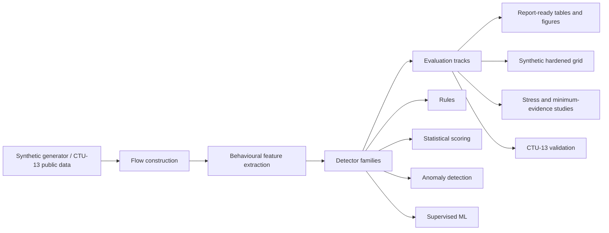

# Beaconing Detection System

Flow-level behavioural detection of command-and-control beaconing under timing jitter, size variation,
burst traffic, hard benign profiles, and CTU-13 public-data domain shift.

**Headline result:** controlled synthetic detection can look strong, but minimum evidence requirements
and CTU-13 schema/domain shift sharply limit naive generalisation.

## At A Glance

| Question | Short answer |
| --- | --- |
| Task | Detect C2 beaconing from flow-level behaviour, not payload signatures. |
| Approach | Compare interpretable rules, statistical scoring, anomaly detection, and supervised ML on synthetic and CTU-13 traffic. |
| Best synthetic model | Random Forest is strongest on the controlled synthetic benchmark. |
| Core finding | Minimum evidence matters: evasive low-event, high-jitter, size-overlapping flows need substantially more history. |
| CTU takeaway | Public CTU-13 validation exposes schema/domain shift that synthetic results alone would hide. |
| Final claim | This is a comparative flow-level detection study, not a production SOC detector. |

## Why This Matters

Beaconing can look periodic, but real benign traffic and evasive attacker behaviour make simple
periodicity checks unreliable. Attackers can add timing jitter, vary payload sizes, communicate in
bursts, or keep flows short enough that there is not much evidence to learn from. This project studies
where flow-level behavioural detection works, where it breaks, and what changes when the same ideas
are tested against CTU-13 public flow data.

## What This Project Shows

- Flow-level behavioural features can detect fixed, jittered, and bursty synthetic beaconing well.
- Hard benign repeated traffic and shortcut/overlap stress expose false positives and brittle assumptions.
- The strongest research result is a minimum-evidence finding: evasive beaconing needs enough flow
  history before aggregate features become reliable.

## Research Question

How effectively can flow-level statistical and machine learning methods detect beaconing traffic when
attackers introduce timing jitter, size variation, and burst-based communication patterns?

## Architecture



## Key Results

The strongest project finding is the minimum-evidence result: easy beaconing regimes can be detected
with little flow history, while evasive time-and-size jittered traffic requires more evidence before
the current flow-level features become reliable.


On the controlled synthetic benchmark, Random Forest is the strongest overall model, while the frozen
rule baseline remains the main interpretable reference.


The public-data validation story is more cautious. CTU-13 exposes schema and domain shift:
synthetic-transfer RF can detect many botnet-labelled flows but false-positives heavily, while
CTU-native approaches are more honest but still limited.


## Detector Tradeoffs

| Detector family | Role in project | Main strength | Main limitation |
| --- | --- | --- | --- |
| Frozen rules | Interpretable reference baseline | Easy to inspect and explain | Brittle under evasive timing and benign repeated traffic |
| Statistical z-score | Transparent statistical baseline | Simple benign-reference comparison | Weak under multimodal benign behaviour |
| Isolation Forest / LOF | Anomaly baselines | Useful unsupervised comparison point | Not strongest overall; can be unstable at low evidence |
| Logistic Regression | Linear supervised baseline | Clear supervised reference | Less flexible than Random Forest |
| Random Forest | Strongest synthetic benchmark model | Best controlled synthetic performance | Lower interpretability and still weak on hardest low-evidence regimes |

## Public-Data Story

CTU-13 evidence is deliberately split into three stages:

```text
Synthetic direct transfer to CTU
CTU-native unsupervised evaluation
Within-CTU supervised evaluation
```

This separation matters. Synthetic direct transfer exposes domain shift, CTU-native unsupervised
evaluation uses `.binetflow` fields more honestly, and within-CTU supervised evaluation tests whether
those native features have discriminative power under scenario-aware splits.

## Repo Guide

| Path | Purpose |
| --- | --- |
| `src/beacon_detector/` | Core package: generation/loading, flows, features, detectors, evaluation, and CLI. |
| `tests/` | Regression tests for models, features, evaluation, CTU adapters, exports, and CLI plumbing. |
| `docs/project_walkthrough.md` | Quick guided project tour. |
| `docs/report_draft.md` | More complete technical writeup. |
| `results/figures/final_story/` | Headline figures to view first. |
| `results/tables/final_story/` | Curated summary tables for the final story. |
| `results/tables/report_ready/` | Intermediate report-ready summaries used by the final story layer. |
| `data/synthetic/sample_events.csv` | Small generated synthetic sample. |
| `data/public/README.md` | Expected CTU-13 local data layout; raw CTU files are not committed. |

## Project Walkthrough

For a compact reader-facing tour of the project, use:

```text
docs/project_walkthrough.md
```

The walkthrough connects the README figures, the minimum-evidence finding, the CTU domain-shift
result, and one local scorer command. It is not a separate dashboard or production monitoring
interface.

## Setup

```powershell
pip install -r requirements.txt
pip install -e .
```

Optional lint tooling:

```powershell
pip install -e ".[dev]"
```

## Quick Start

Run the tests:

```powershell
python -m unittest discover -s tests
```

Run a quick synthetic evaluation:

```powershell
python -m beacon_detector.evaluation.run --quick
```

## Reproduce Key Artifacts

Regenerate report-ready and final-story artifacts from existing exports:

```powershell
python -c "from beacon_detector.evaluation.report_artifacts import build_report_artifacts; build_report_artifacts()"
```

## CTU Evaluation Commands

Run CTU direct-transfer evaluation:

```powershell
python -m beacon_detector.evaluation.run_ctu13 --scenario ctu13_scenario_5=data/public/ctu13/scenario_5/capture20110815-2.binetflow --scenario ctu13_scenario_7=data/public/ctu13/scenario_7/capture20110816-2.binetflow --scenario ctu13_scenario_11=data/public/ctu13/scenario_11/capture20110818-2.binetflow --output-dir results/tables/ctu13_multi
```

Run CTU-native feature-path comparison:

```powershell
python -m beacon_detector.evaluation.run_ctu13_native --scenario ctu13_scenario_5=data/public/ctu13/scenario_5/capture20110815-2.binetflow --scenario ctu13_scenario_7=data/public/ctu13/scenario_7/capture20110816-2.binetflow --scenario ctu13_scenario_11=data/public/ctu13/scenario_11/capture20110818-2.binetflow --output-dir results/tables/ctu13_native
```

Run within-CTU supervised evaluation:

```powershell
python -m beacon_detector.evaluation.run_ctu13_supervised --scenario ctu13_scenario_5=data/public/ctu13/scenario_5/capture20110815-2.binetflow --scenario ctu13_scenario_7=data/public/ctu13/scenario_7/capture20110816-2.binetflow --scenario ctu13_scenario_11=data/public/ctu13/scenario_11/capture20110818-2.binetflow --output-dir results/tables/ctu13_supervised
```

## Local Scorer

Run the lightweight local CTU scorer:

```powershell
python -m beacon_detector.cli.score --input data/public/ctu13/scenario_7/capture20110816-2.binetflow --input-format ctu13-binetflow --detector ctu-native-random-forest --train-scenario ctu13_scenario_5=data/public/ctu13/scenario_5/capture20110815-2.binetflow --train-scenario ctu13_scenario_11=data/public/ctu13/scenario_11/capture20110818-2.binetflow --output-dir results/scored/ctu13_scenario_7
```

## Limitations

- Synthetic traffic is useful for controlled experiments, but it is simplified and can contain generator artifacts.
- CTU-13 introduces schema and domain shift; public-data results are deliberately reported separately.
- Flow-level aggregate features have evidence limits for evasive low-event traffic.
- The local scorer is a research interface, not a production SOC detector.

## What I Learned

- Good synthetic performance can hide realism and transfer problems.
- Minimum evidence matters more than headline accuracy for evasive beaconing.
- Public-data transfer is harder than within-distribution benchmarking.
- Interpretable baselines remain useful even when they are not top performers.

## Final Conclusion

Synthetic benchmark results are strong, especially for Random Forest, but the most important
research finding is the minimum-evidence result: easy beaconing regimes can be detected with little
flow history, while evasive low-event, high-jitter, size-overlapping regimes require substantially
more evidence. CTU-13 validation exposes schema and domain shift that synthetic results alone would
hide. CTU-native modelling is a more honest public-data path than forcing CTU bidirectional rows
through synthetic-style features, but it is still not deployment proof. This project is a
comparative flow-level detection study, not a production SOC detector.
