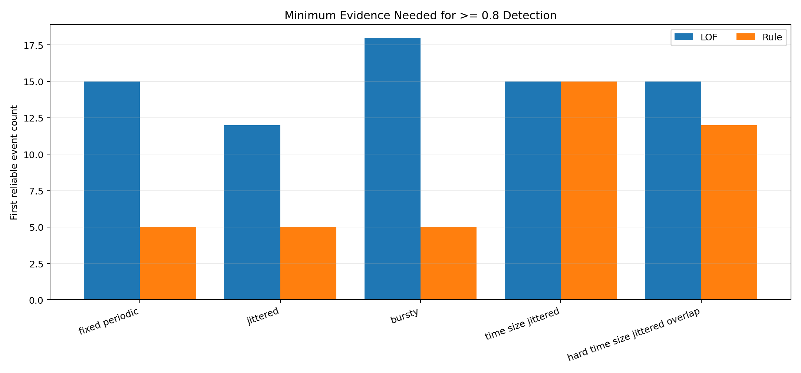
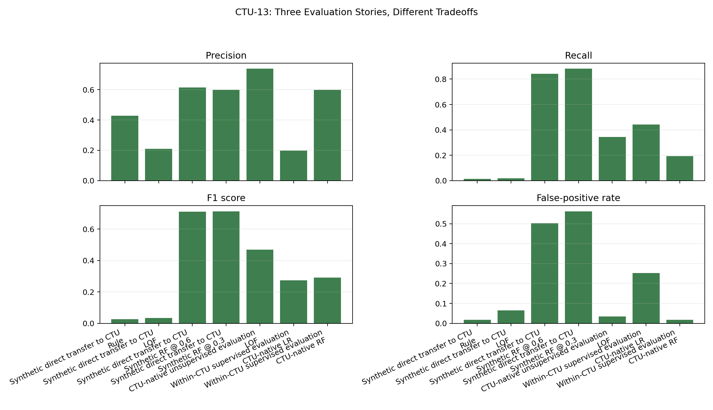
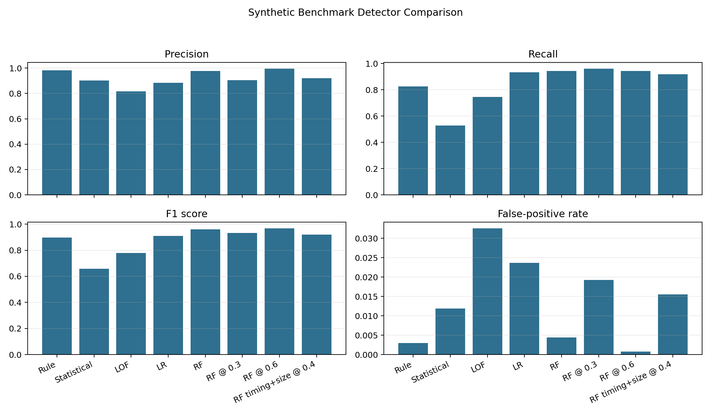

# Beaconing Detection System

A Python research project for detecting command-and-control beaconing from flow-level behaviour. The
project compares interpretable rules, statistical scoring, anomaly detection, and supervised machine
learning under timing jitter, size variation, burst behaviour, hard benign traffic, and public-data
schema shift.

## Research Question

How effectively can flow-level statistical and machine learning methods detect beaconing traffic when
attackers introduce timing jitter, size variation, and burst-based communication patterns?

## Final Story

The final project story is:

1. Flow-level behavioural detection works well on controlled synthetic beaconing.
2. Hard benign traffic and shortcut stress expose limits.
3. Minimum evidence is the central research finding.
4. CTU-13 exposes schema and domain shift.
5. CTU-native modelling is more honest than forcing CTU through synthetic features.
6. This is a comparative flow-level detection study, not a production SOC detector.

The detailed writeup is in:

```text
docs/report_draft.md
```

Curated presentation artifacts are in:

```text
results/tables/final_story/
results/figures/final_story/
```

## Key Results

The strongest project finding is the minimum-evidence result: easy beaconing regimes can be
detected with little flow history, while evasive time-and-size jittered traffic requires more
evidence before the current flow-level features become reliable.



The public-data validation story is more cautious. CTU-13 exposes schema and domain shift:
synthetic-transfer RF can detect many botnet-labelled flows but false-positives heavily, while
CTU-native approaches are more honest but still limited.



On the controlled synthetic benchmark, Random Forest is the strongest overall model, while the
frozen rule baseline remains the main interpretable reference.



## Implemented Pipeline

```text
synthetic/public data -> flows -> behavioural features -> detectors -> evaluations -> exports
```

The synthetic flow key is:

```text
src_ip, dst_ip, dst_port, protocol
```

## Implemented Detectors

- Frozen rule baseline
- Statistical z-score baseline
- Isolation Forest
- Local Outlier Factor
- Logistic Regression
- Random Forest

Random Forest is strongest on the controlled synthetic benchmark. The frozen rule baseline remains
the main interpretable reference. LOF is the most meaningful anomaly comparison, but not the lead
model.

## Public-Data Story

CTU-13 evidence is deliberately split into three stages:

```text
Synthetic direct transfer to CTU
CTU-native unsupervised evaluation
Within-CTU supervised evaluation
```

This separation matters. Synthetic direct transfer exposes domain shift, CTU-native unsupervised
evaluation uses `.binetflow` fields more honestly, and within-CTU supervised evaluation tests whether
those native features have discriminative power under scenario-aware splits.

## Setup

```powershell
pip install -r requirements.txt
pip install -e .
```

Optional lint tooling:

```powershell
pip install -e ".[dev]"
```

## Tests

```powershell
python -m unittest discover -s tests
```

## Common Commands

Quick synthetic evaluation:

```powershell
python -m beacon_detector.evaluation.run --quick
```

Regenerate report-ready and final-story artifacts from existing exports:

```powershell
python -c "from beacon_detector.evaluation.report_artifacts import build_report_artifacts; build_report_artifacts()"
```

Run CTU direct-transfer evaluation:

```powershell
python -m beacon_detector.evaluation.run_ctu13 --scenario ctu13_scenario_5=data/public/ctu13/scenario_5/capture20110815-2.binetflow --scenario ctu13_scenario_7=data/public/ctu13/scenario_7/capture20110816-2.binetflow --scenario ctu13_scenario_11=data/public/ctu13/scenario_11/capture20110818-2.binetflow --output-dir results/tables/ctu13_multi
```

Run CTU-native feature-path comparison:

```powershell
python -m beacon_detector.evaluation.run_ctu13_native --scenario ctu13_scenario_5=data/public/ctu13/scenario_5/capture20110815-2.binetflow --scenario ctu13_scenario_7=data/public/ctu13/scenario_7/capture20110816-2.binetflow --scenario ctu13_scenario_11=data/public/ctu13/scenario_11/capture20110818-2.binetflow --output-dir results/tables/ctu13_native
```

Run within-CTU supervised evaluation:

```powershell
python -m beacon_detector.evaluation.run_ctu13_supervised --scenario ctu13_scenario_5=data/public/ctu13/scenario_5/capture20110815-2.binetflow --scenario ctu13_scenario_7=data/public/ctu13/scenario_7/capture20110816-2.binetflow --scenario ctu13_scenario_11=data/public/ctu13/scenario_11/capture20110818-2.binetflow --output-dir results/tables/ctu13_supervised
```

Run the lightweight local CTU scorer:

```powershell
python -m beacon_detector.cli.score --input data/public/ctu13/scenario_7/capture20110816-2.binetflow --input-format ctu13-binetflow --detector ctu-native-random-forest --train-scenario ctu13_scenario_5=data/public/ctu13/scenario_5/capture20110815-2.binetflow --train-scenario ctu13_scenario_11=data/public/ctu13/scenario_11/capture20110818-2.binetflow --output-dir results/scored/ctu13_scenario_7
```

## Final Conclusion

Synthetic benchmark results are strong, especially for Random Forest, but the most important
research finding is the minimum-evidence result: easy beaconing regimes can be detected with little
flow history, while evasive low-event, high-jitter, size-overlapping regimes require substantially
more evidence. CTU-13 validation exposes schema and domain shift that synthetic results alone would
hide. CTU-native modelling is a more honest public-data path than forcing CTU bidirectional rows
through synthetic-style features, but it is still not deployment proof. This project is a
comparative flow-level detection study, not a production SOC detector.

In short: This project is a comparative flow-level detection study, not a production SOC detector.
