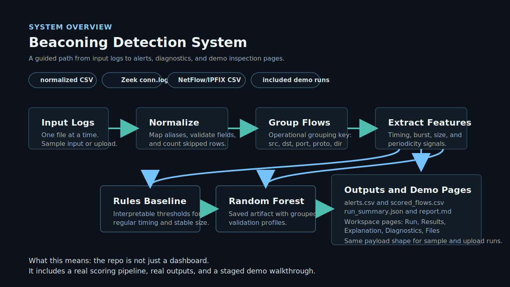

# Beaconing Detection System

This repo has two layers that fit together:

- an operational path for scoring flow logs and writing readable outputs
- a research path for testing how well those ideas hold up under synthetic stress and CTU-13 shift

At the top level, you can run a live demo, score normalized CSV / Zeek `conn.log` /
NetFlow/IPFIX-style CSV, and inspect the result page by page. Under that, the repo still keeps the
full comparative evaluation pipeline that produced the research figures and tables.

**Headline result:** strong synthetic performance does not automatically transfer to public flow
data. Minimum evidence requirements and schema/domain shift remain the core limits.

## Where To Start

- If you just want the shortest path through the project, stay on `main`, open the [live
  demo](https://beaconing-detection-system-wwuf.vercel.app), and run one of the included inputs.
- If you want the cleaner operational implementation history, the `operational-system` branch keeps
  that line of work intact as well.
- If you want the research story first, jump to the figures and tables in the `Results` section
  below.

## Why This Repo

- Real operational ingestion path: normalized CSV, Zeek `conn.log`, and NetFlow/IPFIX-style CSV.
- Hybrid scoring path: interpretable rules plus saved-model Random Forest scoring without retraining.
- Validation discipline: grouped validation, threshold profiles selected from out-of-fold scores, and explicit calibration diagnostics.
- Operational outputs: ranked alerts, full scored flows, machine-readable run summary, and readable report.
- Public-data honesty: CTU-13 results are separated from synthetic benchmark claims instead of folded into a cleaner story than the data supports.

## At A Glance

| Question | Short answer |
| --- | --- |
| Detection task | Command-and-control beaconing from flow behaviour, not payload signatures. |
| Operational path | Normalize logs, group flows, extract behavioural features, score, and write analyst-readable outputs. |
| Research path | Compare rules, statistical scoring, anomaly baselines, and supervised ML under synthetic stress and CTU-13 transfer. |
| Strongest synthetic model | Random Forest on the controlled synthetic benchmark. |
| Strongest finding | Minimum evidence matters: evasive low-event, high-jitter, size-overlapping flows need substantially more history. |
| Public-data takeaway | CTU-13 exposes schema/domain shift that synthetic results alone would hide. |
| Final claim | Serious flow-level detection system and comparative research repo, not a production SOC platform. |

## Live Demo

The demo is meant to feel guided rather than crowded:

- Live app: [beaconing-detection-system-wwuf.vercel.app](https://beaconing-detection-system-wwuf.vercel.app)
- `/` gives the short version of what the system does
- `/workspace` starts the run
- `/workspace/results` shows the main finding
- `/workspace/explanation` slows down and explains one flagged flow
- `/workspace/diagnostics` shows what was loaded and what was skipped
- `/workspace/files` keeps the raw outputs and command details out of the way until you want them

The app can work in two modes:

- run one of the included sample inputs
- upload a small file and score it through the separate Python demo service

That split keeps the main answer easy to find while still letting you inspect the full workflow.

## Architecture

If you want the quick mental model, it is this:



1. You start with either an included input or a small uploaded file.
2. The demo service validates the file and maps field aliases into one normalized event shape.
3. The scorer groups repeated connections into candidate flows using the operational grouping key.
4. The feature pipeline measures timing regularity, burst shape, and size stability.
5. Rules and the saved Random Forest artifact both score the flows.
6. The run writes `alerts.csv`, `scored_flows.csv`, `run_summary.json`, and `report.md`.
7. The Next.js workspace lets you read those results one page at a time instead of dumping
   everything onto one screen.

The same flow in shorthand:

```text
input file
  -> normalize
  -> group flows
  -> extract features
  -> rules + RF scoring
  -> alerts, report, summary
  -> workspace pages
```

## Core Result

Controlled synthetic benchmarks are strong, especially for Random Forest, but the decisive result is
not raw benchmark performance. The decisive result is that evidence limits and public-data shift
change the story materially: harder low-evidence beaconing requires more history, and CTU-13 shows
that synthetic wins do not automatically survive contact with a different schema.

## Results

The strongest project finding is the minimum-evidence result: easy beaconing regimes can be detected
with little flow history, while evasive time-and-size jittered traffic requires more evidence before
the current flow-level features become reliable.


On the controlled synthetic benchmark, Random Forest is the strongest overall model, while the frozen
rule baseline remains the main interpretable reference.


The public-data validation result is more cautious. CTU-13 exposes schema and domain shift:
synthetic-transfer RF can detect many botnet-labelled flows but false-positives heavily, while
CTU-native approaches are better aligned with the public data schema but still limited.


Headline tables that match these figures live in:

- `results/tables/final_story/headline_detector_comparison.csv`
- `results/tables/final_story/minimum_evidence_story_table.csv`
- `results/tables/final_story/ctu_three_stage_comparison.csv`
- `results/tables/final_story/ctu_supervised_tradeoff_table.csv`

## Results and Limits

- Flow-level behavioural features can detect fixed, jittered, and bursty synthetic beaconing well.
- Hard benign repeated traffic and shortcut/overlap stress expose false positives and brittle assumptions.
- Minimum evidence is a first-order constraint: low-event evasive flows remain difficult until enough history accumulates.
- CTU-13 results are materially weaker than synthetic results and are reported separately on purpose.
- RF operational scores remain uncalibrated ranking scores unless a later calibrated artifact path is added.

## Detector Tradeoffs

| Detector family | Role in project | Main strength | Main limitation |
| --- | --- | --- | --- |
| Frozen rules | Interpretable reference baseline | Easy to inspect and explain | Brittle under evasive timing and benign repeated traffic |
| Statistical z-score | Transparent statistical baseline | Simple benign-reference comparison | Weak under multimodal benign behaviour |
| Isolation Forest / LOF | Anomaly baselines | Useful unsupervised comparison point | Not strongest overall; can be unstable at low evidence |
| Logistic Regression | Linear supervised baseline | Clear supervised reference | Less flexible than Random Forest |
| Random Forest | Strongest synthetic benchmark model | Best controlled synthetic performance | Lower interpretability and still weak on hardest low-evidence regimes |

## Public-Data Validation

CTU-13 evidence is deliberately split into three stages:

```text
Synthetic direct transfer to CTU
CTU-native unsupervised evaluation
Within-CTU supervised evaluation
```

This separation matters. Synthetic direct transfer exposes domain shift, CTU-native unsupervised
evaluation uses `.binetflow` fields directly, and within-CTU supervised evaluation tests whether
those native features have discriminative power under scenario-aware splits.

## Repo Guide

| Path | Purpose |
| --- | --- |
| `demo-app/` | Next.js app for the live demo. The workspace is split into Run, Results, Explanation, Diagnostics, and Files pages. |
| `demo-app/public/demo-scenarios/` | Checked-in sample scenario payloads used by the live demo workspace. |
| `src/beacon_detector/` | Core package: generation/loading, flows, features, detectors, evaluation, and CLI. |
| `src/beacon_detector/demo_service/` | Separate Python API for live upload-and-score demo requests. |
| `tests/` | Regression tests for models, features, evaluation, CTU adapters, exports, and CLI plumbing. |
| `docs/live_demo_service.md` | Local run/deploy notes for the upload-scoring service. |
| `docs/operational_demo.md` | Live demo flow, local run steps, and notes about the older static snapshot. |
| `docs/operational_system.md` | Operational batch scoring design and v1 command contract. |
| `docs/operational_example.md` | Tiny end-to-end operational CLI example using checked-in CSV fixtures. |
| `docs/project_walkthrough.md` | Guided project walkthrough. |
| `docs/report_draft.md` | More complete technical writeup. |
| `results/figures/final_story/` | Headline figures to view first. |
| `results/tables/final_story/` | Curated summary tables for the final story. |
| `results/tables/report_ready/` | Intermediate report-ready summaries used by the final story layer. |
| `data/synthetic/sample_events.csv` | Small generated synthetic sample. |
| `data/public/README.md` | Expected CTU-13 local data layout; raw CTU files are not committed. |

## Project Walkthrough

For a compact reader-facing tour of the project, use:

```text
docs/project_walkthrough.md
```

The walkthrough connects the README figures, the minimum-evidence result, the CTU domain-shift
result, and one local scorer command. It is not a dashboard or production monitoring interface.

## Setup

```powershell
py -3.10 -m venv .venv
.\.venv\Scripts\Activate.ps1
python -m pip install --upgrade pip
python -m pip install -r requirements.txt
python -m pip install -e .
```

Optional lint tooling:

```powershell
python -m pip install -e ".[dev]"
```

## Quick Start

If you want the most human path through the repo, do this:

1. Run the Next.js app in `demo-app/`
2. Open `/workspace`
3. Run one of the included inputs
4. Walk through Results -> Explanation -> Diagnostics -> Files

That path is deliberate:

- `Results` answers "what did it flag?"
- `Explanation` answers "why did it flag that?"
- `Diagnostics` answers "how clean was the input?"
- `Files` answers "what did the run actually write?"

If you want the command-line path instead, the sections below cover the batch scorer and training
commands.

Run the tests:

```powershell
python -m unittest discover -s tests
```

Run lint checks:

```powershell
python -m ruff check .
```

Build the checked-in live demo scenarios:

```powershell
python scripts/build_operational_demo.py
```

Run a quick synthetic evaluation:

```powershell
python -m beacon_detector.evaluation.run --quick
```

Run the upload-scoring demo service locally:

```powershell
python -m beacon_detector.demo_service
```

Run the Next.js demo app locally:

```powershell
cd demo-app
npm install
npm run dev
```

## Operational Batch CLI

The operational batch path scores a normalized CSV, Zeek `conn.log`, or NetFlow/IPFIX-style CSV as
one batch and writes four default outputs:

```text
alerts.csv
scored_flows.csv
run_summary.json
report.md
```

Canonical normalized CSV columns:

| Column | Required | Notes |
| --- | --- | --- |
| `timestamp` | Yes | ISO-8601 timestamp; naive timestamps are treated as UTC. |
| `src_ip` | Yes | Source host. |
| `direction` | Yes | Direction label used in the flow grouping key. |
| `dst_ip` | Yes | Destination host. |
| `dst_port` | Yes | Destination port. |
| `protocol` | Yes | `tcp` or `udp`. |
| `total_bytes` | Yes | Non-negative integer. |
| `src_port` | No | Captured for context, not used in default grouping. |
| `duration_seconds` | No | Non-negative numeric value. |
| `total_packets` | No | Non-negative integer. |
| `label` | Training only | `benign`, `beacon`, or `unknown`; unknown rows are skipped by training. |

Validate a normalized CSV:

```powershell
beacon-ops validate --input data/operational/sample_normalized.csv
```

Score a normalized CSV:

```powershell
beacon-ops score --input data/operational/sample_normalized.csv --input-format normalized-csv --output-dir results/operational/run_001
```

Train a Random Forest model from labelled normalized CSV rows:

```powershell
beacon-ops train-model --train data/operational/labelled_train.csv --output-dir models/operational/rf_v1
```

Training artifacts include StratifiedGroupKFold validation metrics when there are enough benign and
beacon groups. The groups use the same operational key as scoring:
`src_ip + dst_ip + dst_port + protocol + direction`.
The model directory also includes an artifact manifest with feature names, label mapping, validation
metrics, dependency versions, training-source references, and persistence warnings.

Export synthetic traffic into that same training contract for bootstrap/demo runs:

```powershell
beacon-ops export-synthetic --output data/operational/synthetic_train.csv --seed 7
```

Synthetic exports are useful for smoke tests and demonstrations, but they are not deployment-ready
training evidence.

Score with the saved model artifact loaded at runtime:

```powershell
beacon-ops score --input data/operational/sample_normalized.csv --input-format normalized-csv --model-artifact models/operational/rf_v1 --output-dir results/operational/run_002
```

Saved RF artifacts include validation-backed threshold profiles: `conservative`, `balanced`, and
`sensitive`. Select one at score time:

```powershell
beacon-ops score --input data/operational/sample_normalized.csv --input-format normalized-csv --model-artifact models/operational/rf_v1 --profile balanced --output-dir results/operational/run_003
```

Score a Zeek `conn.log`:

```powershell
beacon-ops score --input data/zeek/conn.log --input-format zeek-conn --output-dir results/operational/zeek_run_001
```

Score a NetFlow/IPFIX-style CSV:

```powershell
beacon-ops score --input data/flows/netflow.csv --input-format netflow-ipfix-csv --output-dir results/operational/netflow_run_001
```

Run one exact checked-in NetFlow/IPFIX example:

```powershell
beacon-ops score --input data/operational/fixtures/netflow_common_aliases.csv --input-format netflow-ipfix-csv --output-dir results/operational/example_netflow_fixture
```

Open the older checked-in static demo snapshot:

```text
docs/operational_demo.html
```

For the live app, use the Next.js workspace in `demo-app/` and point it at the separate Python
service with `NEXT_PUBLIC_DEMO_API_BASE_URL`.

Run the checked-in end-to-end example:

```powershell
beacon-ops score --input data/operational/example_score.csv --input-format normalized-csv --output-dir results/operational/example_rules
```

Without `--model-artifact`, scoring uses the conservative rules path. With `--model-artifact`,
scoring loads the saved Random Forest artifact and writes hybrid rules + RF scores without retraining.
The `run_summary.json` file is also the score-run manifest: it records output roles, score semantics,
ingestion counts, skipped-row reasons, grouping policy, runtime environment, and loaded-model
metadata.

## Interpret Scores

- `rule_score` is the interpretable baseline score before thresholding.
- `rf_score` is an uncalibrated Random Forest score from the saved artifact. Use it for ranking and threshold policies, not as a direct probability.
- `hybrid_score` is the normalized ranking score used to combine rules and RF signals.
- `confidence` is a threshold-relative display heuristic in `alerts.csv`, not a calibrated probability.
- `report.md` and `run_summary.json` record the active threshold profile, grouped-validation metrics, and calibration diagnostics from out-of-fold training scores.

## Known Ingestion Limits

- The operational adapter path supports `tcp` and `udp`; unsupported protocols are skipped and recorded in `run_summary.json`.
- Zeek ingestion expects a standard `conn.log` with a `#fields` header and the usual connection columns.
- NetFlow/IPFIX CSV ingestion is alias-based. It handles common exporter field names and IPFIX Information Element names, but it does not implement template negotiation or every vendor-specific column.
- Header-only inputs fail fast, malformed required values fail fast, and optional missing fields are left empty in the normalized event record.
- CTU `.binetflow` remains in the research/demo path and is not the operational training contract.

## Reproduce Key Artifacts

Regenerate report-ready and final-story artifacts from existing exports:

```powershell
python -c "from beacon_detector.evaluation.report_artifacts import build_report_artifacts; build_report_artifacts()"
```

Refresh the checked-in live demo scenario payloads:

```powershell
python scripts/build_operational_demo.py
```

## CTU Evaluation Commands

Run CTU direct-transfer evaluation:

```powershell
python -m beacon_detector.evaluation.run_ctu13 --scenario ctu13_scenario_5=data/public/ctu13/scenario_5/capture20110815-2.binetflow --scenario ctu13_scenario_7=data/public/ctu13/scenario_7/capture20110816-2.binetflow --scenario ctu13_scenario_11=data/public/ctu13/scenario_11/capture20110818-2.binetflow --output-dir results/tables/ctu13_multi
```

The optional background-as-benign sensitivity path caps retained CTU Background feature rows per
scenario by default so it can complete on a local workstation; the conservative policy remains the
headline CTU direct-transfer result.

Run CTU-native feature-path comparison:

```powershell
python -m beacon_detector.evaluation.run_ctu13_native --scenario ctu13_scenario_5=data/public/ctu13/scenario_5/capture20110815-2.binetflow --scenario ctu13_scenario_7=data/public/ctu13/scenario_7/capture20110816-2.binetflow --scenario ctu13_scenario_11=data/public/ctu13/scenario_11/capture20110818-2.binetflow --output-dir results/tables/ctu13_native
```

Run within-CTU supervised evaluation:

```powershell
python -m beacon_detector.evaluation.run_ctu13_supervised --scenario ctu13_scenario_5=data/public/ctu13/scenario_5/capture20110815-2.binetflow --scenario ctu13_scenario_7=data/public/ctu13/scenario_7/capture20110816-2.binetflow --scenario ctu13_scenario_11=data/public/ctu13/scenario_11/capture20110818-2.binetflow --output-dir results/tables/ctu13_supervised
```

## Local Scorer

Run the lightweight local CTU scorer:

```powershell
python -m beacon_detector.cli.score --input data/public/ctu13/scenario_7/capture20110816-2.binetflow --input-format ctu13-binetflow --detector ctu-native-random-forest --train-scenario ctu13_scenario_5=data/public/ctu13/scenario_5/capture20110815-2.binetflow --train-scenario ctu13_scenario_11=data/public/ctu13/scenario_11/capture20110818-2.binetflow --output-dir results/scored/ctu13_scenario_7
```

## Limitations

- Synthetic traffic is useful for controlled experiments, but it is simplified and can contain generator artifacts.
- CTU-13 introduces schema and domain shift; public-data results are deliberately reported separately.
- Flow-level aggregate features have evidence limits for evasive low-event traffic.
- The local scorer is a research interface, not a production SOC detector.

## Final Conclusion

Synthetic benchmark results are strong, especially for Random Forest, but the most important
research finding is the minimum-evidence result: easy beaconing regimes can be detected with little
flow history, while evasive low-event, high-jitter, size-overlapping regimes require substantially
more evidence. CTU-13 validation exposes schema and domain shift that synthetic results alone would
hide. CTU-native modelling is a better public-data path than forcing CTU bidirectional rows through
synthetic-style features, but it is still not deployment proof. This project is a
comparative flow-level detection study, not a production SOC detector.
