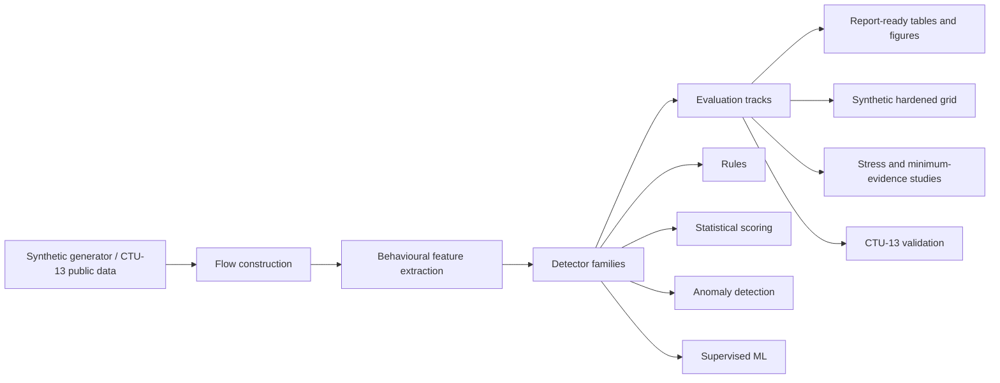

# Report Outline

This document is a structured skeleton for turning the beaconing detection project into a coursework report, portfolio writeup, or future formal paper-style report. It is intentionally an outline rather than a polished final report.

## 1. Introduction

### Project Motivation

- Command-and-control beaconing is a common pattern in malware and post-compromise activity.
- Beaconing traffic often appears as repeated outbound communication to an external destination.
- Attackers can make detection harder by adding timing jitter, payload-size variation, and burst-based communication.
- This project investigates whether flow-level behavioural statistics and ML models can still detect beaconing under those evasive conditions.

### Why Flow-Level Detection Matters

- Flow-level features are less invasive than payload inspection and can be used when payloads are encrypted.
- Many real environments collect flow-like telemetry rather than full packet payloads.
- Flow-level detection is useful, but it has limits when few events are available or when attackers remove regularity.

### High-Level Contribution

- Built a modular Python pipeline for synthetic traffic generation, flow construction, feature extraction, multiple detector baselines, and evaluation exports.
- Compared interpretable rules, statistical scoring, anomaly detection, and supervised ML on the same feature representation.
- Identified a minimum-evidence limitation for low-event evasive beaconing.

### System Architecture Diagram

Use this simple architecture diagram near the start of the report to show the end-to-end research pipeline:



Key point to explain:

- The same flow and feature pipeline supports multiple detector families, making the comparisons easier to interpret.

## 2. Research Question

### Primary Research Question

How effectively can flow-level statistical and machine learning methods detect beaconing traffic when attackers introduce timing jitter, size variation, and burst-based communication patterns?

### Supporting Questions

- How well do interpretable rule-based methods perform compared with statistical and ML methods?
- Which beaconing scenarios are easiest or hardest to detect?
- How do hard benign repeated-communication profiles affect false positives?
- Does supervised ML generalize to held-out jitter, low-event, and benign-profile regimes?
- How much flow history is required before each detector becomes reliable?

## 3. Threat Model / Problem Definition

### Beaconing Definition In This Project

- A beacon is modelled as repeated communication from a source host to an external destination.
- The detection unit is a flow, not an individual packet.
- Current flow key:

```text
src_ip, dst_ip, dst_port, protocol
```

### Evasions Studied

- Timing jitter: inter-arrival times vary around a mean interval.
- Payload-size jitter: event sizes vary rather than remaining constant.
- Burst-based communication: events occur in clusters separated by sleeps.
- Combined timing and size jitter: both timing and size regularity are weakened.
- Low-event evasive flows: too few observations are available to infer stable behaviour.

### Detector Visibility

- The detector sees flow-level event metadata such as timestamps, endpoints, ports, protocol, event sizes, and labels during supervised training.
- The detector does not inspect payload contents.
- The detector does not currently use DNS names, TLS metadata, process context, user context, or bidirectional request/response semantics.

## 4. Synthetic Benchmark Design

### Why Synthetic Generation Was Used

- Synthetic data allows controlled manipulation of jitter, size variation, burst shape, benign profile mix, and event count.
- Controlled generation makes it possible to isolate individual failure factors.
- Synthetic data also avoids depending on unavailable or sensitive real traffic during early research.

### Malicious Scenario Families

- `fixed_periodic`: stable intervals and stable sizes; easiest beaconing family.
- `jittered`: timing varies around a mean interval.
- `bursty`: clustered events separated by sleep periods.
- `time_size_jittered`: both timing and size vary; hardest malicious family in the current benchmark.

### Benign Profile Families

- `normal_software_update`: repeated benign update-like communication.
- `normal_telemetry`: telemetry-like repeated communication.
- `normal_cloud_sync`: irregular sync-like behaviour.
- `normal_api_polling`: repeated benign polling.
- `normal_bursty_session`: benign burst/sleep behaviour.
- `normal_keepalive`: long-lived low-rate repeated communication.

### Hardening The Benchmark

- Normal traffic was made multi-event and profile-labelled so it would not be trivially sparse.
- Benign profiles were made explicitly distinguishable for false-positive diagnosis.
- Shortcut/overlap stress cases were added to make benign and malicious flows overlap in event count, size variation, duration, and repeated communication patterns.

### Realism Limitations

- Synthetic data is not real network traffic.
- The generator can contain artifacts that supervised models may exploit.
- Real environments contain richer protocol behaviour, user behaviour, background noise, and infrastructure patterns.
- Results should be treated as controlled benchmark findings, not deployment proof.

## 5. Flow Construction And Feature Engineering

### Flow Definition

- Events are grouped by:

```text
src_ip, dst_ip, dst_port, protocol
```

- Events inside each flow are sorted by timestamp.
- Flow-level labels and scenario names are preserved for evaluation.

### Feature Families

- Timing features: inter-arrival mean, median, standard deviation, IQR, MAD, CV, trimmed CV.
- Cadence features: near-median interval fractions, dominant interval fraction, periodicity score.
- Rate features: events per second and events per minute.
- Burst features: burst count, average burst size, max burst size, sleep duration, burst-to-idle ratio.
- Size features: mean size, median size, size CV, size range, size-bin structure, near-median size fraction.
- Low-sample similarity features: adjacent-gap similarity, longest similar gap run, normalized gap range.

### Key Design Decisions

- Feature engineering is central because all detector families use the same `FlowFeatures` representation.
- Undefined values are handled explicitly for short flows.
- 1-event and 2-event flows are allowed to exist without crashing feature extraction.
- The project favours readable, inspectable features over opaque transformations.

### Important Newer Features

- Interval consistency bands within 10%, 20%, and 30% of median gap.
- Coarse interval-bin dominance and interval-bin count.
- Gap range divided by median gap.
- Median absolute percentage deviation of inter-arrival times.
- Structural size features such as dominant size-bin fraction and normalized size range.

## 6. Detector Progression

### Compact Detector Tradeoff Table

Use this table before the detailed detector subsections to make the model comparison easy to scan:

| Detector family | Role in project | Main strength | Main limitation |
| --- | --- | --- | --- |
| Frozen rules | Interpretable reference baseline | Easy to inspect and explain | Brittle under evasive timing and benign repeated traffic |
| Statistical z-score | Transparent statistical baseline | Simple benign-reference comparison | Weak under multimodal benign behaviour |
| Isolation Forest / LOF | Anomaly baselines | Useful unsupervised comparison point | Not strongest overall; can be unstable at low evidence |
| Logistic Regression | Linear supervised baseline | Clear supervised reference | Less flexible than Random Forest |
| Random Forest | Strongest synthetic benchmark model | Best controlled synthetic performance | Lower interpretability and still weak on hardest low-evidence regimes |

### Rule Baseline

- Interpretable detector using explicit thresholds over timing, size, repetition, and burst features.
- Frozen as the main interpretable baseline.
- Strong on obvious fixed, jittered, and bursty beaconing.
- Brittle against evasive traffic and benign repeated communication.

### Statistical Baseline

- Transparent z-score / benign-reference style detector.
- Uses benign reference behaviour to score distance from normality.
- Easy to explain but weak under multimodal benign traffic.

### Anomaly Baselines

- Isolation Forest and Local Outlier Factor were implemented.
- LOF is the more meaningful anomaly comparison in the current project.
- Anomaly methods are useful comparison points but not best overall.
- LOF showed unstable low-evidence behaviour in minimum-evidence analysis.

### Supervised ML Baselines

- Logistic Regression and Random Forest were implemented.
- Random Forest is strongest overall on the current synthetic benchmark.
- Held-out validation and shortcut stress testing show RF still struggles with low-event evasive `time_size_jittered` flows.

## 7. Evaluation Methodology

### Metrics Used

- Precision
- Recall
- F1 score
- False positive rate
- Confusion matrix
- Per-scenario detection rate
- Per-profile false-flag rate
- Multi-seed mean and spread where applicable

### Hardened Synthetic Grid

- Multi-case benchmark covering fixed, jittered, bursty, time+size jittered, class imbalance, variable normal traffic, and hard benign repeated profiles.
- Used for primary detector comparison.

### Multi-Seed Evaluation

- Multiple seeds reduce dependence on one synthetic sample.
- Results are aggregated across seeds and exported to CSV/JSON tables.

### Held-Out Validation

- Tests whether supervised models generalize to held-out conditions.
- Includes high jitter, low event count, withheld benign bursty profile, and withheld time+size jittered scenario variants.

### Shortcut / Overlap Stress Testing

- Adds explicit overlap between benign and malicious flows in event count, size variation, duration, and repeated communication patterns.
- Designed to test whether RF is robust or relying on synthetic shortcuts.

### Signal Study

- One-factor-at-a-time analysis for hard `time_size_jittered`.
- Varied event count, timing jitter, size jitter, duration, benign overlap, and timing+size interaction.
- Found event count was the dominant collapse factor.

### Minimum-Evidence Analysis

- Sweeps event count across important scenario families.
- Determines how many flow events are required before detectors become reliable.
- Uses a sustained reliability criterion rather than one-off detection spikes.

## 8. Results

### Overall Detector Comparison

- RF is the strongest overall detector on the current synthetic benchmark.
- Rule baseline remains strong and interpretable, especially on obvious beaconing.
- Statistical baseline is transparent but weak against multimodal benign traffic.
- LOF is useful as an anomaly comparison but is not strongest overall.

### Held-Out Validation Findings

- RF generalizes well to some held-out regimes but weakens on low-event and time+size jittered conditions.
- Feature ablation showed RF still relies heavily on event count and size-structure features.
- Lower RF threshold improves recall but must be interpreted carefully.

### Shortcut-Stress Findings

- RF performed strongly on aggregate shortcut-stress metrics.
- However, it completely missed the hardest low-event high-jitter size-overlapping `time_size_jittered` flows.
- Those missed flows were confidently classified as benign, not near-threshold.

### CTU-13 Public Validation

- Keep the CTU evaluation explicitly split into `Synthetic direct transfer to CTU`, `CTU-native unsupervised evaluation`, and `Within-CTU supervised evaluation`.
- Direct synthetic transfer exposes schema/domain shift and high false positives.
- CTU-native features use `.binetflow` fields directly and better match the public-data schema.
- Within-CTU supervised evaluation tests CTU-native feature discriminative power with scenario-aware splits.
- These results strengthen the public-data evaluation without making a production deployment claim.

### Minimum-Evidence Findings

- Easy regimes can be detected with very little history:

```text
fixed_periodic, jittered, bursty:
  RF reliable at about 3 events.
```

- Evasive regimes require more evidence:

```text
time_size_jittered:
  RF full @ threshold 0.3 reliable at about 12 events.
  RF full @ threshold 0.6 needs closer to 18-24 events depending on variant.
```

- This supports the conclusion that low-event evasive beaconing is a minimum-evidence problem for flow-level aggregate features.

## 9. Discussion

### What Worked

- Flow-level behavioural features can detect fixed, jittered, and bursty beaconing well in controlled synthetic settings.
- Multi-seed and held-out evaluation made the benchmark more credible than single-sample testing.
- Explicit benign profile labels made false-positive analysis much clearer.
- RF provided the strongest synthetic benchmark performance.
- The rule baseline remained useful as an interpretable reference.

### What Failed Or Remained Difficult

- Low-event `time_size_jittered` traffic remains hard.
- More features improved some aggregate results but did not solve the hardest evasive case.
- Moderate stress training did not fix the hardest unseen stress-eval cases.
- LOF had unstable low-evidence behaviour.

### Why The Hardest Regime Is Difficult

- At 5-9 events, there may be too little repeated behaviour to estimate reliable flow-level structure.
- High timing jitter weakens cadence features.
- High size jitter weakens stable-size features.
- Benign overlap makes shortcut-like features less trustworthy.
- Aggregate flow features may lose separability when attackers remove obvious regularity and keep the flow short.

## 10. Limitations

### Synthetic-Only Benchmark

- CTU-13 public-data validation has been started, but it exposes schema/domain shift rather than proving deployment readiness.
- Synthetic findings are controlled research findings, not deployment claims.

### Flow-Level Aggregate Representation

- The project does not inspect payloads.
- The project does not currently use packet directionality, DNS/TLS metadata, process context, or host context.
- Aggregate features may discard ordering information that could help with partial-flow detection.

### Shortcut Learning Concerns

- Supervised models may learn generator-specific patterns.
- Feature ablation and shortcut stress testing reduce this risk but do not eliminate it.

### Hardest Evasive Regime

- Low-event high-jitter size-overlapping `time_size_jittered` remains a clear failure case.
- The current system should not be presented as robust to all evasive beaconing.

## 11. Future Work

### Public Dataset Validation

- Extend beyond the current CTU-13 subset only if this becomes a larger follow-on project.
- Keep synthetic direct transfer, CTU-native unsupervised evaluation, and within-CTU supervised evaluation separate.
- Validate on additional public datasets before making broader real-world claims.

### Sequence-Aware / Partial-Flow Features

- Add features that preserve more temporal ordering information.
- Study whether sequence-aware features help before 12 events are available.

### Richer Flow Context

- Add directionality features if bidirectional event data is introduced.
- Add request/response ratio, inbound/outbound bytes, and protocol context where available.

### Experiment Presets

- Add clear named presets for quick, hardened, shortcut-stress, signal-study, and minimum-evidence evaluations.
- Make important experiments easier to rerun reproducibly.

### Reporting Improvements

- Use `results/tables/final_story/` and `results/figures/final_story/` as the curated presentation layer.
- Keep raw experiment exports as supporting evidence.
- Avoid dashboards unless this becomes a separate product/demo project.

## 12. Suggested Figures / Tables

### Tables

- Detector comparison table across rule, statistical, LOF, Logistic Regression, and Random Forest.
- Per-scenario detection-rate table.
- Benign profile false-positive table.
- Held-out validation summary table.
- Shortcut-stress comparison table.
- Minimum-evidence threshold table.

### Figures

- Detection rate versus event count by detector and scenario.
- RF probability versus event count for `time_size_jittered`.
- False-positive rate by benign profile.
- Feature importance chart for Random Forest.
- Confusion matrix comparison for major detector families.

## 13. Conclusion

### Core Takeaways

- Flow-level behavioural detection works well for fixed, jittered, and bursty synthetic beaconing.
- Random Forest is currently the strongest overall detector on the synthetic benchmark.
- The frozen rule baseline is still important because it is interpretable.
- The hardest unsolved regime is low-event high-jitter size-overlapping `time_size_jittered` beaconing.
- Minimum evidence is a central finding: the current feature representation needs enough flow history before evasive beaconing becomes separable.

### Final Framing

The project should be presented as a controlled study of flow-level beaconing detection under increasing evasion, not as a finished production detector. Its strongest contribution is showing both where flow-level behavioural ML works and where it begins to fail.
